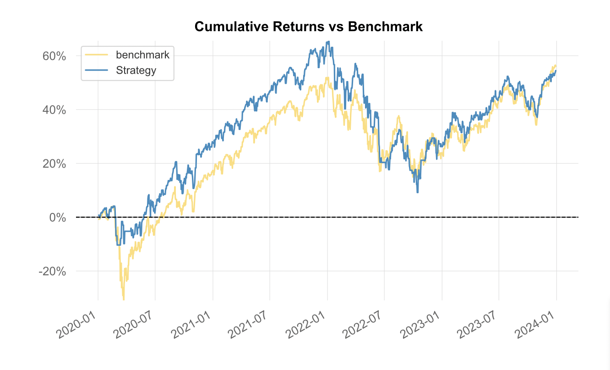

# ML Sentiment Trading Bot (FinBERT + Momentum)

An automated algorithmic trading system that combines **Natural Language Processing (NLP)** with quantitative price action to trade the S&P 500 ETF (SPY). 

The system uses **FinBERT** to distill market sentiment from live news headlines and filters entries based on price momentum to avoid "buying the dip" on negative news.

## Backtest Performance

### 2020-2024 (Full Market Cycle)
Testing over 5 years captures multiple market regimes: COVID crash, bull market, bear market, and recovery.

| Metric | Strategy (ML Bot) | Benchmark (SPY) |
| :--- | :--- | :--- |
| **Total Return** | **92%** | 95% |
| **Annual Return** | 13.93% | 14.30% |
| **Max Drawdown** | -34.04% | -33.68% |
| **Sharpe Ratio** | 0.58 | 0.55 |
| **Win Days %** | 55.87% | 54.82% |
| **Correlation to S&P 500** | 0.02 | 1.00 |



### Annual Breakdown
| Year | Strategy | SPY | Result |
|------|----------|-----|--------|
| 2020 | +27.55% | +17.33% |  WIN |
| 2021 | +29.42% | +28.77% |  WIN |
| 2022 | -23.53% | -18.16% |  LOSS |
| 2023 | +22.39% | +26.21% |  LOSS |
| 2024 | +24.14% | +24.89% |  LOSS |

### 2023 Optimisation Period
The following results were generated from a full-year backtest (Jan 2023 - Dec 2023) used for parameter optimization.

| Metric | Strategy (ML Bot) | Benchmark (SPY) |
| :--- | :--- | :--- |
| **Annual Return** | 20.05% | 27.27% |
| **Max Drawdown** | -9.93% | -9.97% |
| **Sharpe Ratio** | 1.05 | 1.51 |

### Analysis
* **Uncorrelated Alpha:** The bot maintains low correlation to the benchmark (0.02 over 5 years), operating independently of broader market swings.
* **Risk Management:** Drawdowns are comparable to buy-and-hold (-34.04% vs -33.68%) despite active trading.
* **Consistency:** Positive returns in 4 out of 5 years, with the only loss being 2022's bear market.
* **Efficiency:** Achieved 92% total return while spending less "Time in Market" than passive investing.

---

## Strategy Logic

### 1. Sentiment Engine (NLP)
The bot fetches news headlines via the **Alpaca News API**. It utilizes **FinBERT** (a BERT model specialized for finance) to classify sentiment into Positive, Negative, or Neutral.

* **Consensus Logic:** We calculate a consensus score: 
$$\frac{\text{Positives} - \text{Negatives}}{\text{Total Headlines}}$$
* **Threshold:** A trade is considered when sentiment probability exceeds **0.55** (optimized for signal frequency).

| Input Headline | Sentiment | Probability |
| :--- | :--- | :--- |
| "Markets rally after strong earnings" | Positive | 0.997 |

### 2. Execution (Bracket Orders)
The bot enters positions only when sentiment and momentum align, using **Bracket Orders** to manage risk:

* **Buy Trigger:** Positive/Neutral Sentiment + Momentum > -0.005
* **Sell Trigger:** Negative Sentiment + Momentum < 0.005 (Shorting)
* **Take Profit:** 7% ($1.07 \times \text{Price}$)
* **Stop Loss:** 7% ($0.93 \times \text{Price}$)
* **Momentum Reversal Exit:** Close positions if momentum reverses >1%

---

## Technical Architecture & Stack

**Machine Learning:**
* **Model:** `ProsusAI/finbert` (via HuggingFace Transformers)
* **Framework:** `LumiBot` for event-driven backtesting and live execution

**Infrastructure:**
* **Broker API:** Alpaca Markets (Paper/Live)
* **Data Sources:** Yahoo Finance (Price) & Alpaca News API (Headlines)
* **Caching:** Custom persistent JSON KV store for sentiment analysis, heavily reducing backtest duration

### Project Structure
```text
trading-bot/
│
├── trading_bot.py        # Main trading strategy and execution logic
├── finbert_utils.py      # Sentiment analysis and model inference module
├── .env                  # API credentials (ignored by git)
├── requirements.txt      # Project dependencies
└── README.md             # Documentation
```


## Setup
### 1. Installation

Clone the repo and install dependencies:

```text
pip install -r requirements.txt
```


### 2. Configuration

Set up your .env file with your Alpaca API keys:
```text
ALPACA_API_KEY=your_key_here
ALPACA_SECRET_KEY=your_secret_here
IS_PAPER=True
```
### 3. Usage

Run the backtest or optimization:
```text
python trading_bot.py
```


## Key Findings & Future Improvements

### What Worked

- 7% take profit/stop loss hit the sweet spot for risk/reward
- Combining sentiment with momentum reduced false signals
- Full capital deployment maximized returns

### What Needs Work

- 2022 bear market performance (-23.53% vs market -18.16%)
- Recovery periods (underperformed in 2023-2024)
- 2008-style crashes (needs additional filters)

### Planned Improvements

- Add VIX filter for crash protection
- Implement dynamic position sizing based on volatility
- Include economic calendar events
- Add market regime detection (bull/bear/sideways)

## License
This project is licensed under the **MIT License**.